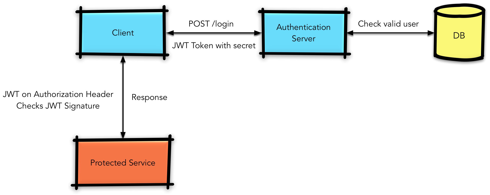

<p align="center"></p>

> ### Python + React codebase containing end-to-end token based authentication using JSON Web Tokens. 

## Motivation
You are smart. You want a secure app. You also want to be able to setup a system where the authentication is isolated to its own environment. Low and behold, tokens. It's never been a better time to use a token-based authentication scheme, whether that be cloud-based or not. 

## Why use tokens?
+ **CORS** - Say goodbye to that monolith. Haven't you always wanted to move to that new hot microservice architecture? Using tokens allows you to send network requests to any server on any domain! 
+ **Stateless** - You no longer need to keep any session information with your back-end. Just store that token in ```localStorage``` and be done with it. The token contains all the information pertinent to invalidating sessions, etc. 
+ **Decoupled** - We live in a society of SPAs and decoupling the front-end and back-end is the status quo. You want this. 

## Getting Started
As shown in the diagram below there are three main players in this example, the API, the Authentication Sever, and the Client. So, to begin ```fork``` or ```clone``` this repository. It would be ideal to setup the authentication server and the API in virtual environments. 

### Authentication Server
1. ```cd authentication_server``` then, ```pip install -r requirements.txt```
2. ```python server.py```

### API
1. ```cd api```, then, ```pip install -r requirements.txt```
2. ```python run.py```

### Frontend
1. ```cd app```, then, ```npm install```
2. To run, ```npm run dev```
3. Server should be running at ```localhost:3000```

## Theory


### Usage

There are only two users currently set up for this contrived example and they are hardcoded into the authentication server, as you can see below. Obviously in a real-world app these would be users inside a databse, or if using something like AWS roles that you have designated.

```python
  valid_user_1 = {'username': "test_user_1", 'password': 'Happy123'}
  valid_user_2 = {'username': 'test_admin', 'password': 'LessHappy123'}
```

